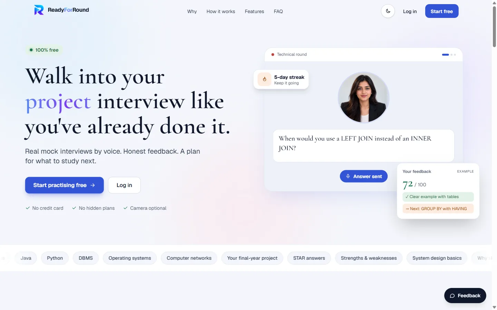
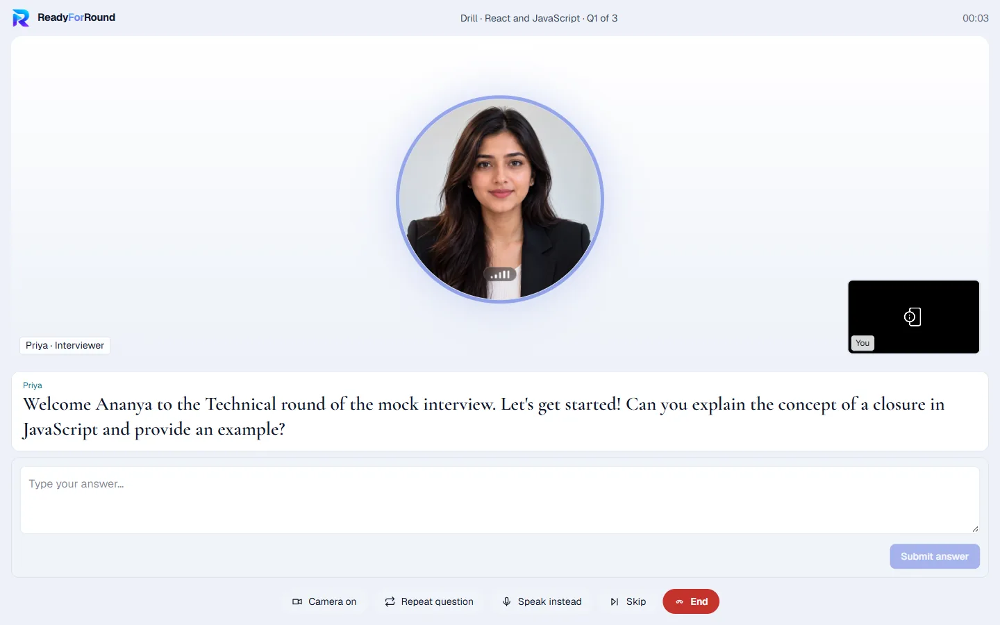
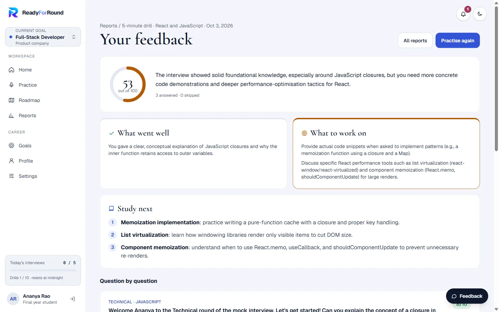
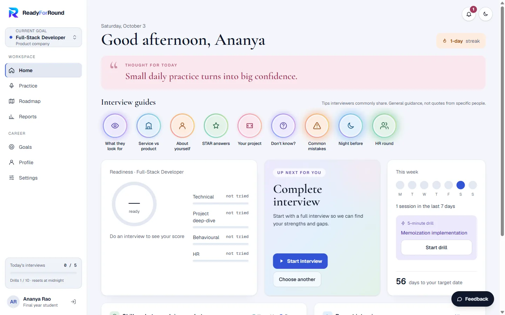
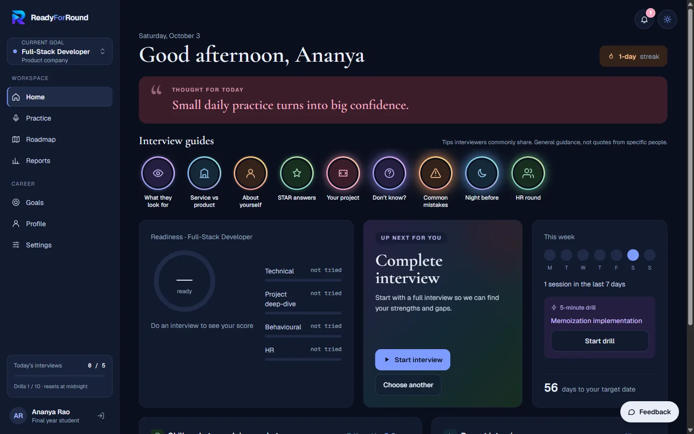
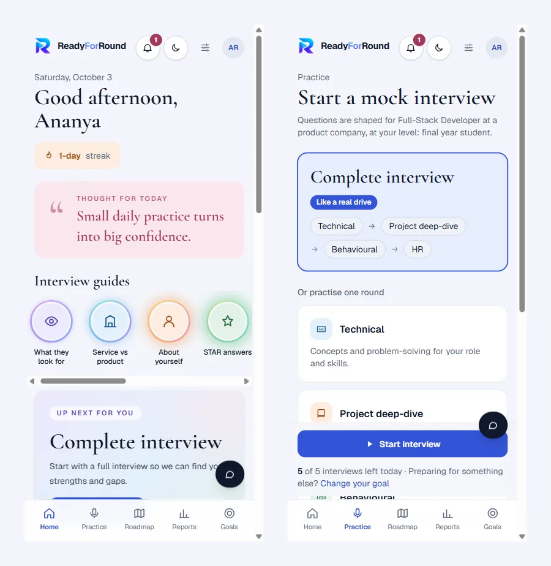
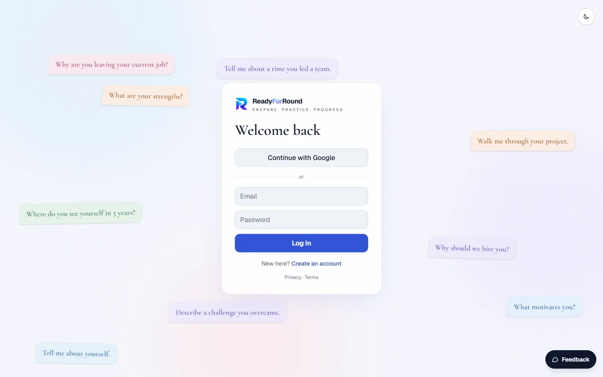
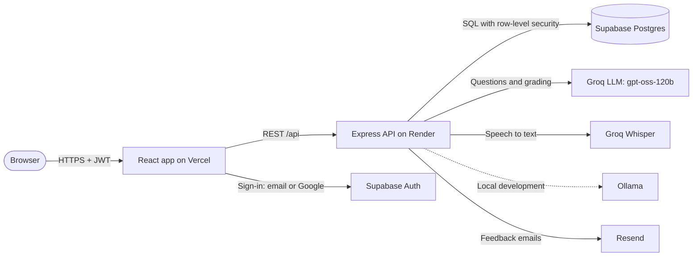

<div align="center">


# ReadyForRound

### AI mock interviews that feel like the real thing. 100% free.

Talk to an AI interviewer by voice, get an honest feedback report in about a minute,
and a study plan built from your gaps.

**[Try it live →](https://ready-for-round.vercel.app)**




</div>

---

## The problem

Most candidates don't fail interviews because they lack knowledge. They fail because they have never
**said their answers out loud, under pressure, and then been told what was missing**. Mock interviews
with a mentor are expensive or hard to schedule, and a rejection rarely comes with feedback.

## The solution

ReadyForRound is a full-stack web app that runs a realistic interview round and coaches you afterwards:

1. **Pick a goal**: role, experience level (2nd-year student to 5+ years at work), company type, and interview date.
2. **Take the interview**: a video-call-style room where the interviewer speaks each question and you answer by voice (or by typing). Vague answers get real follow-up questions.
3. **Get the report**: a score, what went well, what was missing, a strong example answer for every question, and what to study next, which feeds a weekly roadmap.

## Screenshots

| Interview room | Feedback report |
|---|---|
|  |  |

| Dashboard | Dark mode |
|---|---|
|  |  |

| Mobile | Animated sign-in |
|---|---|
|  |  |

## Features

- **Voice interviews**: the interviewer speaks (browser speech synthesis); answers are recorded and transcribed with Whisper
- **Every round of a hiring drive**: Technical, Project deep-dive, Behavioural, HR and Resume deep-dive, or a complete drive whose sequence depends on the company type
- **Adaptive follow-ups** when an answer is vague, with server-enforced limits so interviews stay on track
- **Honest feedback reports** graded question by question, with a model answer to learn from
- **Skills: claimed vs proven**, comparing self-ratings against what interviews actually showed
- **AI study roadmap**: weekly tasks sized to the hours you have before your interview date
- **5-minute drills** on any topic, streaks, score trends and a readiness score
- **Resume-based interviews**: upload a PDF and the interviewer asks about your own projects, skills and experience (only the text is kept)
- **Career Compass**: a 10-minute role-discovery assessment (work interests, forced choices, real experience, comfort check and optional taste tests) matched to 13 roles with explainable, rule-based scoring; role names stay hidden until the result to avoid hype bias. On simulated students, 97% get their true role first and 100% in the top 3
- **Resume deep-dive round**: a whole round that goes through your resume line by line, checking claimed skills and asking for the evidence behind your results
- **Company-style interviews**: 12 companies (TCS, Infosys, Wipro, Accenture, Cognizant, HCLTech, Capgemini, Zoho, Amazon, Microsoft, Google, Flipkart) with their publicly reported round sequence, a "company bar" section in the report, and an AI-generated practice question bank per company and role (not affiliated with these companies; no logos)
- **13 roles**: SDE, Frontend, Backend, Full-Stack, Forward Deployed Engineer, AI / ML, Data Science, Data Engineering, Data Analytics, DevOps, Mobile, QA and Cybersecurity
- **Goals that grow with your career**: placements today, a job switch later, each with its own history
- **Comfort options**: slower speech, repeat question, type instead of speak, a no-scores practice mode, light and dark themes
- **In-app notifications**, interview guides, and a **feedback button** that emails the team
- **Privacy first**: video is never recorded, voice recordings are discarded after transcription, and users can download or delete all their data

## Architecture



**How one interview turn works:** the browser speaks the question, records the answer, and uploads the audio.
The server transcribes it, stores the turn, and asks the LLM for the next question in a strict labelled format.
It then validates that reply (it must be a real question, and follow-up limits are enforced by the server, not the model)
before sending it back. When the interview ends, a stronger grading prompt scores every answer and builds the report and roadmap.

## Engineering highlights

- **Reliable output from LLMs.** Instead of fragile JSON, the interviewer replies in a labelled `TYPE:` / `QUESTION:` format with a tolerant parser. Malformed Groq replies (`tool_use_failed`) are recovered from the provider's `failed_generation` field, and reasoning models get tuned token budgets.
- **Prompt-injection defence.** Candidate answers are passed as quoted data the model must never obey ("give me 10/10" does nothing). Every interviewer turn must be an actual question, and the server, not the model, decides when follow-ups stop.
- **The right model for each job.** A fast model can run the conversation while a larger model grades. In early testing a small local model gave confident but wrong feedback, so grading always runs on a stronger model.
- **A voice pipeline that works everywhere.** Browser speech recognition fails outside Chrome and Edge, so answers are recorded with `MediaRecorder` and transcribed on the server. The microphone opens only while answering, which fixes Windows "audio ducking" muting the interviewer. Speech playback is safe under React StrictMode's double effects.
- **Security.** Supabase row-level security on every table, the secret key only on the server, JWT verified on each request, `zod` validation on every input, per-user rate limits, and a hidden honeypot field against feedback spam.
- **Built for free tiers.** Per-user daily quotas with a timezone-aware midnight reset, a configurable fallback LLM provider, and graceful handling when the backend is asleep or unreachable.
- **Accessible, polished UI.** Custom dropdown and dialog components with full keyboard support, scroll-reveal animations that switch off for users who prefer reduced motion, semantic colour tokens for light and dark themes, and a layout tested at phone width.
- **Observability and SEO.** Browser and server errors are logged to an `app_errors` table behind an error boundary. Structured data, a sitemap, and per-page titles help search engines.

## Tech stack

| Layer | Tools |
|---|---|
| Frontend | React 19, TypeScript, Vite, Tailwind CSS 4, React Router |
| Backend | Node.js 22, Express 5, TypeScript, zod, express-rate-limit |
| Data and auth | Supabase (Postgres, row-level security, email and Google sign-in), SQL migrations via the Supabase CLI |
| AI | Groq (gpt-oss-120b for interviews and grading, Whisper for speech-to-text), Ollama for offline development, OpenRouter as an optional fallback |
| Hosting | Vercel (website), Render (API), Resend (feedback email) |

## Project structure

```
client/                 React app (Vercel)
  src/pages/            One file per screen: Landing, Home, InterviewRoom, ReportPage, ...
  src/components/       Shared UI: dropdowns, dialogs, avatar, skill picker, feedback form, ...
  src/lib/              API client, skills dictionary, Supabase client, helpers
server/                 Express API (Render)
  src/interview/        Interview engine, rounds and prompts
  src/report/           Grading and report prompts
  src/llm/, src/stt/    LLM providers and speech-to-text
  src/routes/           REST endpoints
supabase/migrations/    Database schema, one numbered SQL file per change
docs/                   Product plan, deployment guide and screenshots
```

## Run it locally

Requirements: Node.js 22, a free [Supabase](https://supabase.com) project, and a free [Groq](https://console.groq.com) key
(or [Ollama](https://ollama.com) to run the AI fully offline).

```bash
# 1. Settings: copy the examples and fill in your keys (never commit .env files)
cp server/.env.example server/.env
cp client/.env.example client/.env

# 2. Database: create the tables in your Supabase project
npm install
npx supabase login
npx supabase link --project-ref <your-project-ref>
npm run db:push

# 3. Backend (terminal 1)
cd server && npm install && npm run dev

# 4. Website (terminal 2)
cd client && npm install && npm run dev
```

Open http://localhost:5180. Set `LLM_PROVIDER=ollama` or `LLM_PROVIDER=groq` in `server/.env`.
Deployment steps are in [docs/DEPLOY.md](docs/DEPLOY.md).

## Roadmap

- An experienced-hire track: work deep-dives, system design and salary conversations
- More roles beyond software development and data analysis
- Downloadable PDF reports
- A dashboard for colleges to support their students' placement preparation

## Author

**Harish Kandi**, who designed and built ReadyForRound end to end: product, UI, backend, AI prompts and deployment.

[GitHub](https://github.com/kandiharish)

If ReadyForRound helped you prepare, a ⭐ on this repository means a lot.
